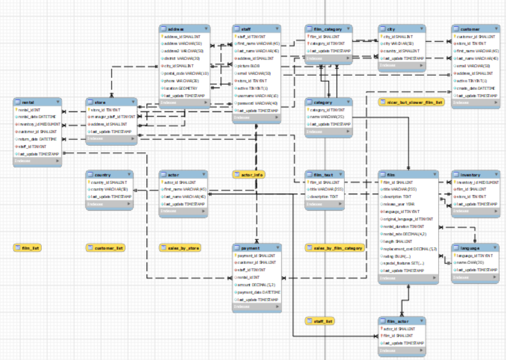

# **EVALUACIÓN MÓDULO 2: Extracción de Información de Web y Bases de Datos**

En este módulo, hemos trabajado con la base de datos Sakila, poniendo en práctica diversas herramientas de SQL, como queries avanzadas, JOINS, y subconsultas. Utilizando MySQL, hemos accedido a la base de datos para obtener y analizar datos clave de películas, actores y clientes.

Diagrama de la Base de Datos

*Este diagrama ilustra la estructura de las tablas de la base de datos Sakila.*

## ✨ Resultados Destacados ✨
A continuación, se muestran algunos de los hallazgos más interesantes durante nuestro análisis de la base de datos de Sakila:

- En la base de datos de Sakila tenemos 1000 películas del 2006(ejercicio 16) sin títulos de películas repetidas (ejercicio 1), de las cuales 223 son películas con clasificación PG-13 (ejercicio 2)

- 48 del conjunto de películas, contienen en su descripción la palabra amazing.

- **45,7%** de nuestras películas, tienen una duración mayor a 120 minutos (457 películas, respecto a 1000 total).

- Sólo uno de nuestros actores registrados, se apellida Gibson.

- Más del **57%** de nuestras películas, tienen clasificación: PG,G, o NC-17. (ejercicio 8). Aquí hemos utilizado por ejemplo, esta query para calcularlo:

- Se han contabilizado las películas según su clasificación (ejercicio 9), y el número de alquileres por clasificación (ejercicio 12).

- Eleanor Hunt es nuestra cliente con mayo número de películas alquiladas.

- En la película Indian Love, participaron 10 actores registrados.

- Se han encontrado las las categorías de películas que tienen un promedio de duración superior a 120 minutos.

- El **95,7%** de las películas fueron alquiladas por 5 días o más.

-Sólo 3 películas de comedia duran más de 3 horas: Control Anthem, Saturn Name y Searchers Wait.

## Conclusión 👌

En este análisis de la base de datos Sakila, hemos podido obtener datos interesantes sobre las películas, actores y clientes. A través de queries avanzadas, hemos identificado patrones sobre la duración de las películas, las clasificaciones, los actores involucrados, y el comportamiento de alquiler de los clientes.

Este ejercicio ha sido clave para mejorar las habilidades de consulta en bases de datos y análisis de grandes volúmenes de información.